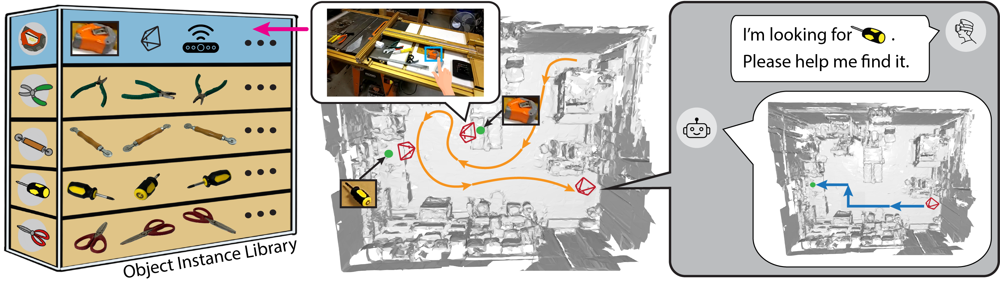
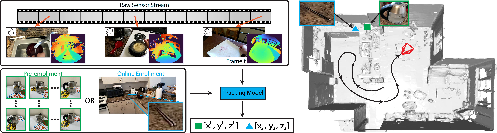
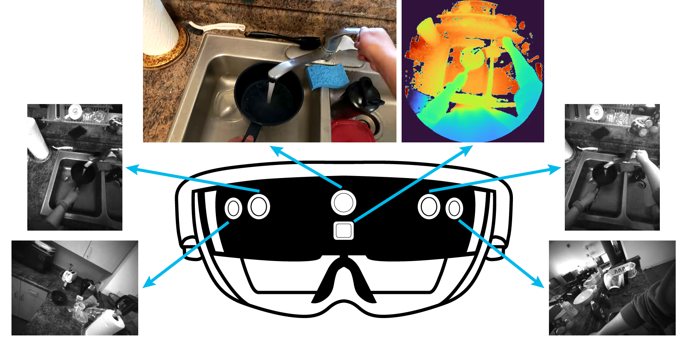

<h2 align="center">
 <b>Instance Tracking in 3D Scenes from Egocentric Videos</b>
</h2>

<h3 align="center">
CVPR 2024
</h3>

<div align="center" margin-bottom="6em">
<a target="_blank" href="https://ics.uci.edu/~yunhaz5/">Yunhan Zhao</a>,
<a target="_blank" href="https://ics.uci.edu/~haoyum3/">Haoyu Ma</a>,
<a target="_blank" href="https://aimerykong.github.io/">Shu Kong</a>,
<a target="_blank" href="https://ics.uci.edu/~fowlkes/">Charless Fowlkes</a>
<br>
[<a target="_blank" href="http://arxiv.org/pdf/2312.04117">arXiv</a>] &nbsp;&nbsp;&nbsp; [<a target="_blank" href="https://drive.google.com/file/d/1VVszWG4mmm0g3ai3EoZw-3cGNBmZCN-9/view?usp=sharing"><span style="color:red">Dataset Download</span></a>]
</div>
&nbsp;

<p align="center">

</p>

Egocentric sensors such as AR/VR devices capture human-object interactions and offer the potential to provide task-assistance by recalling 3D locations of objects of interest in the surrounding environment. This capability requires instance tracking in real-world 3D scenes from egocentric videos (IT3DEgo). We introduce **IT3DEgo** benchmark to develop assistive agents that track the user's environment and provide *contextual guidance* on the **location** of objects of interest. 

## IT3DEgo Benchmark Task Illustration

<p align="center">

</p>

Given a raw RGB-D video sequence with camera poses and object instances of interest, i.e., either by online enrollment (SVOE) or pre-enrollment (MVPE), the goal of our benchmark task is to output the object instance 3D centers in a predefined world coordinate at each timestamp. Please check [our paper](http://arxiv.org/pdf/2312.04117) for more details regarding the benchmark protocol and dataset.

## Benchmark Dataset

<p align="center">

</p>

<p align="center">

</p>

**Benchmark dataset** is available to download [here](https://drive.google.com/file/d/1VVszWG4mmm0g3ai3EoZw-3cGNBmZCN-9/view?usp=sharing). The benchmark dataset is around ~900GB and comes with the following three parts:

- **Raw video sequences.** RGB-D video sequences with per-frame camera pose, captured with HoloLens 2. The video data is organized in the following structure:

```
# Raw video sequence structure

├── Video Seq 1
│   ├── pv                    # rgb camera
│   ├── depth_ahat            # depth camera
│   ├── vlc_ll                # left-left grayscale camera
│   ├── vlc_lf                # left-front grayscale camera
│   ├── vlc_rf                # right-front grayscale camera
│   ├── vlc_rr                # right-right grayscale camera
│   ├── mesh                  # coarse mesh of the surrounding environment
│   ├── pv_pose.json
│   ├── depth_ahat_pose.json
│   ├── vlc_ll_pose.json
│   ├── vlc_lf_pose.json
│   ├── vlc_lf_pose.json
│   └── vlc_rr_pose.json
.
.
.
└── Video Seq N
```
Each camera pose JSON file (e.g., pv_pose.json or depth_ahat_pose.json) contains key value pairs of timestamp and the camera matrix. We also include calibration files that correspond to each raw video sequence. The calibration file specifies the camera parameters and the transformation matrices between each camera (please refer to [hl2ss](https://github.com/jdibenes/hl2ss) for more details). For more information regrading different camera specs on HoloLens 2 (pv, depth, and grayscales), please also check this [document](https://arxiv.org/pdf/2008.11239) on arXiv.

- **Annotations.** We provide three types of annotations to support the study of the benchmark problem. The annotation data is organized in the following structure:

```
# Annotations structure

├── Video Seq 1
│   ├── labels.csv
│   ├── 3d_center_annot.txt
│   ├── motion_state_annot.txt
│   ├── 2d_bbox_annot
│   │   ├── 0.txt
│   │   .
│   |   .
│   |   .
│   |   └── K.txt
│   └── visuals                 # clear visuals of object instances on a specific frame, only for visualization
│       ├── timestamp_instance_1.png
│       .
│       .
│       .
│       └── timestamp_instance_K.png
.
.
.
└── Video Seq N
```
Each line in `label.csv` describes the name of object instances to track, such as cup_1. 
The file `motion_state_annot.txt` describes the binary object motion state at each frame. Each line in this file has the format of `instance id, timestamp_start, timestamp_end`. The interval between `timestamp_start` and `timestamp_end` indicates the object remains stationary in this period. In other words, the object instance is being interacted with the user outside of each interval.
Inside the `2d_bbox_annot` folder, we provide the axis-aligned 2D bounding boxes for each object roughly every 5 frames if the object is visible. `0.txt` corresponds to the *first* object instance described in `label.csv`. Each line in `0.txt` has the format of `timestamp, x_min, y_min, x_max, y_max`. 
The `3d_center_annot.txt` file includes the 3D center of each object instance in a **predefined world coordinate**. Each line in this file has the format of `timestamp_start, timestamp_end, instance id, x, y, z, location id`. Location id describes the number of location changes of the current object with zero-based indexing.

- **Enrollment information.** We study two distinct setups to specify object instances of interest: single-view online enrollment (SVOE) and multi-view pre-enrollment (MVPE). Please check [our paper](http://arxiv.org/pdf/2312.04117) for a detailed description of each enrollment. 

```
# Single-view online enrollment (SVOE)

├── Video Seq 1
│   └── svoe.txt
.
.
.
└── Video Seq N

===============================================================

# Multi-view pre-enrollment (MVPE)

├── Instance 1                # folder name corresponds to instance names in label.csv in the annotation folder
│   ├── instance_image_1.jpg
│   .
│   .
│   .
│   └── instance_image_24.jpg
.
.
.
└── Instance M
```
Each line in `svoe.txt` file represents `instance id, timestamp, x_min, y_min, x_max, y_max`. Instand id corresponds to the label.csv in the annotation folder with zero-based indexing. In other words, the first object instance in `Annotations/Video Seq 1/label.csv` corresponds to instance 0 in `Video Seq 1/svoe.txt`.

## Run Demo Code

We release the code in the form of Jupyter Notebook plus Python files. It includes the step-by-step implementation of our proposed method, utilizing SAM and DINOvs for the benchmark task. Make sure you have installed the following requirements before running the demo code.
- PyTorch 2.0
- [hl2ss](https://github.com/jdibenes/hl2ss)
- [SAM](https://github.com/facebookresearch/segment-anything)
- [DINOv2](https://github.com/facebookresearch/dinov2)

The demo code adopts a slightly modified version of hl2ss and we release the modified code to help run the demo code. If you are interested in moving to the latest version of hl2ss, feel free to adjust accordingly. The demo code is tested on the internal benchmark dataset that shares a slightly different file structure from the public released one. Please adjust the file paths to run the code on your own machine.

## Notes
- The benchmark dataset now has more object instances! We augment the number of unique object instance from 220 to 240.
- The world coordinate is the same only in the same video sequences. It is not the same even for different video sequences in the same scene. 
- We trimed the RGB video sequences (PV camera) at the beginning and end of the videos to remove the capture initialization frames. While other camera frames are untrimmed to show the entire capture process.
- We collect the mesh files roughly about 5-10 seconds before we capture the actual raw video sequences. Mesh are captured at different timestamps in this period, feel free to pick the timestamp you like. Meshes should look similar but the one captured at "stable" frames should have better camera pose accuracy. In terms of visualizing the mesh, check the tutorials in [hl2ss](https://github.com/jdibenes/hl2ss).

## BibTex
```bibtex
@inproceedings{zhao2024instance,
  title={Instance tracking in 3D scenes from egocentric videos},
  author={Zhao, Yunhan and Ma, Haoyu and Kong, Shu and Fowlkes, Charless},
  booktitle={Proceedings of the IEEE/CVF Conference on Computer Vision and Pattern Recognition},
  pages={21933--21944},
  year={2024}
}
```